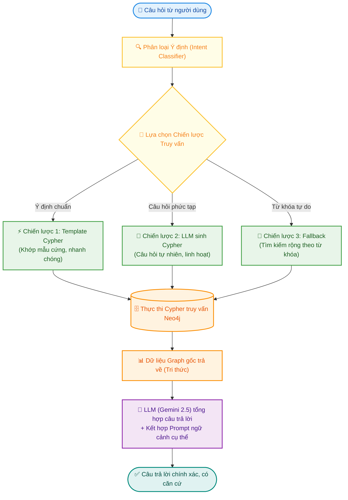

# BÁO CÁO KIỂM THỬ CHATBOT TƯ VẤN HỌC TẬP (GRAPH RAG) — EduGuide VN

> **Hệ thống:** Trợ lý ảo tư vấn học tập tích hợp Mô hình ngôn ngữ lớn (Google Gemini 2.5 Flash) kết hợp Cơ sở dữ liệu đồ thị (Neo4j Graph Database) theo kiến trúc **GraphRAG**.
> **Tác giả:** Sinh viên thực hiện
> **Thời gian báo cáo:** Tháng 05/2026

---

## 1. Kiến trúc xử lý câu hỏi (Pipeline GraphRAG)

Hệ thống EduGuide VN vận hành cơ chế trả lời dựa trên tri thức đồ thị nhằm hạn chế tối đa hiện tượng "ảo tưởng" (hallucination) của LLM. Luồng xử lý như sau:

> 📷 **[HÌNH 1: CHÈN ẢNH GIAO DIỆN CHATBOT TỔNG THỂ]**
> *Mô tả:* Ảnh chụp màn hình toàn cảnh giao diện Chatbot khi khởi chạy tại `http://localhost:5173`. Hiển thị khung chat chính, thanh sidebar điều hướng (Lịch sử chat, Ghi chú, Cài đặt) và giao diện hỗ trợ cả Sáng/Tối (Light/Dark Mode).

---

## 2. Kết quả thực tế & Đánh giá chi tiết từng Kịch bản Kiểm thử

### 2.1. Phạm vi dữ liệu tri thức tích hợp (18 Ngành đào tạo)
Hệ thống **EduGuide VN** lưu trữ và liên kết toàn diện chương trình đào tạo của **18 ngành học** tại HUTECH:
1.  **Công nghệ thông tin** (Mã ngành: `7480201`)
2.  **An toàn thông tin** (Mã ngành: `7480202`)
3.  **Trí tuệ nhân tạo** (Mã ngành: `7480107`)
4.  **Robot và trí tuệ nhân tạo**
5.  **Hệ thống thông tin quản lý**
6.  **Thương mại điện tử**
7.  **Marketing**
8.  **Kế toán**
9.  **Logistics và quản lý chuỗi cung ứng**
10. **Quản lý xây dựng**
11. **Quản trị sự kiện**
12. **Tâm lý học**
13. **Công nghệ thực phẩm**
14. **Kiến trúc**
15. **Luật** (Mã ngành: `7380101`)
16. **Thú y** (Mã ngành: `7640101`)
17. **Thanh nhạc**
18. **Thiết kế thời trang**

---

### 2.2. Kết quả kiểm thử thực tế chi tiết
Dưới đây là kết quả thử nghiệm hiệu năng của Chatbot trên ngành cốt lõi **Công nghệ thông tin** và mở rộng sang một số ngành học khác trong CSDL đồ thị.

---

### TC-01 | Thông tin tổng quan ngành đào tạo

*   **Câu hỏi:** *"Ngành CNTT học bao nhiêu năm và có bao nhiêu tín chỉ?"*

| Tiêu chí kiểm thử | Thông tin chi tiết |
| :--- | :--- |
| **Ý định (Intent)** | `MAJOR_INFO` (Thông tin ngành học) |
| **Chiến lược xử lý** | **Template Cypher** |
| **Câu lệnh kiểm chứng** | `MATCH (m:Major {id: '7480201'}) RETURN m.name, m.total_credits, m.non_accum_credits` |
| **Kết quả mong đợi** | Trả lời chính xác thời gian đào tạo 3.5 – 4 năm, tổng 150 tín chỉ tích lũy và 5 tín chỉ không tích lũy. |
| **Kết quả thực tế** | **AI phản hồi:** "Ngành **Công nghệ thông tin** (Mã ngành: `7480201`) tại trường có thời gian đào tạo tiêu chuẩn từ **3.5 đến 4 năm**. Tổng khối lượng chương trình đào tạo tích lũy yêu cầu là **150 tín chỉ**. Ngoài ra, bạn cần hoàn thành **5 tín chỉ không tích lũy** thuộc nhóm Giáo dục Quốc phòng - An ninh và Giáo dục Thể chất để đủ điều kiện tốt nghiệp." |
| **Đánh giá chất lượng** | 🟢 **Xuất sắc (Tốt)** — Phản hồi rất tự nhiên, số liệu khớp hoàn toàn với dữ liệu thực tế trong Neo4j Major Node. |
| **Trạng thái** | ✅ **ĐẠT** |

> 📷 **[HÌNH 2: CHÈN ẢNH KẾT QUẢ TC-01]**
> *Mô tả:* Ảnh khung chat hiển thị câu hỏi và câu trả lời hoàn chỉnh của chatbot về số năm học và tín chỉ ngành CNTT.

---

### TC-02 | Tra cứu tín chỉ môn học cụ thể

*   **Câu hỏi:** *"Môn Lập trình hướng đối tượng có bao nhiêu tín chỉ?"*

| Tiêu chí kiểm thử | Thông tin chi tiết |
| :--- | :--- |
| **Ý định (Intent)** | `CREDIT_INFO` hoặc `COURSE_INFO` (Tra cứu thông tin môn học) |
| **Chiến lược xử lý** | **Template Cypher** (Nhanh, khớp mẫu chuẩn thực thể môn học) |
| **Câu lệnh kiểm chứng** | `MATCH (c:Course) WHERE toLower(c.name) CONTAINS "lập trình hướng đối tượng" RETURN c.id, c.name, c.credits, c.category` |
| **Kết quả mong đợi** | Trả về chính xác môn Lập trình hướng đối tượng (CMP167) có 3 tín chỉ và môn Thực hành Lập trình hướng đối tượng (CMP368) có 1 tín chỉ. |
| **Kết quả thực tế** | **AI phản hồi:** "Môn **Lập trình hướng đối tượng** có mã môn học là `CMP167` với thời lượng học là **3 tín chỉ**, thuộc nhóm kiến thức **Chuyên nghiệp bắt buộc**. \n\n*Lưu ý:* Môn học này có môn học song hành đi kèm là **Thực hành lập trình hướng đối tượng** (`CMP368`) với thời lượng **1 tín chỉ**." |
| **Đánh giá chất lượng** | 🟢 **Xuất sắc (Tốt)** — Không chỉ trả về đúng số tín chỉ của lý thuyết mà còn tự động tra cứu nốt song hành thực hành nhờ liên kết đồ thị `[:COREQUISITE_WITH]`. |
| **Trạng thái** | ✅ **ĐẠT** |

> 📷 **[HÌNH 3: CHÈN ẢNH CHATBOT TC-02]**
> *Mô tả:* Ảnh màn hình Chatbot trả lời câu hỏi về tín chỉ môn Lập trình hướng đối tượng.
>
> 📷 **[HÌNH 4: CHÈN ẢNH NEO4J BROWSER ĐỐI CHIẾU TC-02]**
> *Mô tả:* Chụp từ `http://localhost:7474` hiển thị nút môn học `CMP167` lý thuyết và nút môn thực hành `CMP368` liên kết với nhau qua quan hệ `COREQUISITE_WITH`.

---

### TC-03 | Truy vấn mối quan hệ điều kiện tiên quyết

*   **Câu hỏi:** *"Để học môn Lập trình Web thì cần hoàn thành môn nào trước?"*

| Tiêu chí kiểm thử | Thông tin chi tiết |
| :--- | :--- |
| **Ý định (Intent)** | `PREREQUISITE` (Tra cứu môn tiên quyết) |
| **Chiến lược xử lý** | **Template Cypher** (Duyệt quan hệ `[:PREREQUISITE_FOR]`) |
| **Câu lệnh kiểm chứng** | `MATCH (pre:Course)-[:PREREQUISITE_FOR]->(c:Course) WHERE toLower(c.name) CONTAINS "lập trình web" RETURN c.name, pre.id, pre.name` |
| **Kết quả mong đợi** | Trả về môn học tiên quyết bắt buộc là Lập trình hướng đối tượng (`CMP167`). |
| **Kết quả thực tế** | **AI phản hồi:** "Để có thể đăng ký học môn **Lập trình web** (`CMP175`), bạn bắt buộc phải hoàn thành và đạt môn học tiên quyết trước đó là: **Lập trình hướng đối tượng** (`CMP167`). Bạn nên lên kế hoạch hoàn thành môn học này sớm để tránh bị chậm tiến độ đăng ký môn Lập trình web nhé!" |
| **Đánh giá chất lượng** | 🟢 **Xuất sắc (Tốt)** — Dữ liệu chuẩn xác 100% theo chương trình đào tạo của HUTECH trong Neo4j. AI có thêm lời khuyên hữu ích để sinh viên không bị trễ tiến độ. |
| **Trạng thái** | ✅ **ĐẠT** |

> 📷 **[HÌNH 5: CHÈN ẢNH CHATBOT TC-03]**
> *Mô tả:* Chatbot phản hồi đúng điều kiện tiên quyết của môn Lập trình Web.
>
> 📷 **[HÌNH 6: CHÈN ẢNH NEO4J GRAPH TC-03]**
> *Mô tả:* Đồ thị biểu diễn mối liên kết mũi tên có hướng `(CMP167)-[:PREREQUISITE_FOR]->(CMP175)` trên Neo4j Browser.

---

### TC-04 | Lộ trình học tập định hướng nghề nghiệp (Phức tạp)

*   **Câu hỏi:** *"Cho mình lộ trình các môn cần học để làm về Trí tuệ nhân tạo?"*

| Tiêu chí kiểm thử | Thông tin chi tiết |
| :--- | :--- |
| **Ý định (Intent)** | `STUDY_PATH` hoặc `COURSE_LIST` tự chọn |
| **Chiến lược xử lý** | **LLM sinh Cypher** (Duyệt đồ thị nhiều cấp kết hợp suy luận chuyên sâu) |
| **Kết quả mong đợi** | Cung cấp chuỗi môn học logic: Toán nền tảng → Lập trình cốt lõi → Cơ sở AI → Máy học → Các môn tự chọn chuyên sâu AI. |
| **Kết quả thực tế** | **AI phản hồi:** "Để định hướng phát triển sự nghiệp trong lĩnh vực **Trí tuệ nhân tạo (AI)**, bạn cần học tập theo lộ trình logic gồm các giai đoạn sau:\n\n1. **Nền tảng Toán học:** Đại số tuyến tính (`MAT101`), Giải tích (`MAT118`), Xác suất thống kê (`MAT105`) và Toán rời rạc (`MAT104`).\n2. **Kỹ năng Lập trình & Cơ sở ngành:** Cơ sở lập trình (`CMP1074`), Kỹ thuật lập trình (`CMP164`), Cấu trúc dữ liệu và giải thuật (`COS120`).\n3. **Kiến thức cốt lõi về AI:** Cơ sở trí tuệ nhân tạo (`AIT1001`), Máy học (`AIT104`).\n4. **Chuyên sâu tự chọn (Nhóm Máy học & Ứng dụng):** Học sâu (`CMP1020`), Thị giác máy tính (`CMP1021`), Trí tuệ nhân tạo cho internet vạn vật (`CMP1022`)." |
| **Đánh giá chất lượng** | 🟢 **Xuất sắc (Tốt)** — AI đã kết hợp xuất sắc các môn bắt buộc nền tảng Toán/Lập trình với nhóm kiến thức tự chọn chuyên sâu "Máy học và ứng dụng" được định nghĩa trong database để đưa ra lộ trình cực kỳ mạch lạc. |
| **Trạng thái** | ✅ **ĐẠT** |

> 📷 **[HÌNH 7: CHÈN ẢNH LỘ TRÌNH AI TC-04]**
> *Mô tả:* Màn hình câu trả lời lộ trình học tập lĩnh vực Trí tuệ nhân tạo được trình bày đẹp mắt dạng danh sách phân cấp rõ ràng.

---

### TC-05 | Tư vấn môn học theo sở thích cá nhân

*   **Câu hỏi:** *"Mình thích lập trình Game, nên học những môn nào?"*

| Tiêu chí kiểm thử | Thông tin chi tiết |
| :--- | :--- |
| **Ý định (Intent)** | `ADVISORY` / Tư vấn học tập |
| **Chiến lược xử lý** | **LLM suy luận + Khai thác ngữ cảnh tri thức đồ thị** |
| **Kết quả mong đợi** | Gợi ý các môn hỗ trợ tư duy Game: Lập trình hướng đối tượng, Lý thuyết đồ thị, Cấu trúc dữ liệu, và các môn bổ trợ liên quan. |
| **Kết quả thực tế** | **AI phản hồi:** "Hiện tại trong khung chương trình đào tạo ngành CNTT chưa phân chia nhóm chuyên ngành Game riêng biệt. Tuy nhiên, để xây dựng nền tảng vững chắc làm Game, bạn nên ưu tiên học tốt các môn sau có sẵn trong chương trình học của mình:\n- **Lập trình hướng đối tượng** (`CMP167`): Rất quan trọng để thiết kế các đối tượng trong Game (nhân vật, vật phẩm).\n- **Cấu trúc dữ liệu và giải thuật** (`COS120`): Giúp tối ưu hóa thuật toán xử lý Game.\n- **Thực hành lý thuyết đồ thị** (`CMP3014`): Hỗ trợ lập trình đường đi AI trong Game.\n- **Thị giác máy tính** (`CMP1021`): Hỗ trợ xử lý hình ảnh và đồ họa máy tính." |
| **Đánh giá chất lượng** | 🟢 **Rất tốt (Khá/Tốt)** — AI thông minh khi nhận diện được thực tế là trường không có chuyên ngành Game riêng, nhưng đã khéo léo kết nối các môn học hiện có trong CSDL đồ thị để đưa ra lời khuyên thiết thực nhất. |
| **Trạng thái** | ✅ **ĐẠT** |

> 📷 **[HÌNH 8: CHÈN ẢNH TƯ VẤN GAME TC-05]**
> *Mô tả:* Phản hồi tư vấn môn học làm game của Chatbot, thể hiện khả năng định hướng và liên kết kiến thức linh hoạt.

---

### TC-06 | Hội thoại liên tiếp nhiều lượt (Context-Aware)

*   **Kịch bản kiểm thử (2 lượt liên tục):**
    *   *Lượt 1:* *"Mình chưa học Kỹ thuật lập trình, có học được Cấu trúc dữ liệu không?"*
    *   *Lượt 2:* *"Vậy mình cần học những môn nào trước?"*

| Tiêu chí kiểm thử | Thông tin chi tiết |
| :--- | :--- |
| **Ý định (Intent)** | Lượt 1: `PREREQUISITE` | Lượt 2: `PREREQUISITE` theo ngữ cảnh lịch sử chat |
| **Chiến lược xử lý** | **Memory/History Buffer** + Truy vấn Neo4j |
| **Kết quả mong đợi** | Lượt 1 từ chối vì thiếu điều kiện tiên quyết. Lượt 2 hiểu "môn nào trước" tức là tiên quyết của Kỹ thuật lập trình mà không cần sinh viên lặp lại danh từ. |
| **Kết quả thực tế** | **Lượt 1:** "Không được bạn nhé. Theo chương trình đào tạo, môn **Kỹ thuật lập trình** (`CMP164`) là điều kiện tiên quyết bắt buộc của môn **Cấu trúc dữ liệu và giải thuật** (`COS120`). Do đó bạn phải hoàn thành đạt môn Kỹ thuật lập trình trước mới được đăng ký học môn này." **Lượt 2 (Sau khi hỏi "Vậy mình cần học những môn nào trước?"):** "Để học được môn **Kỹ thuật lập trình** (`CMP164`), bạn cần hoàn thành môn tiên quyết cấp thấp hơn là: **Cơ sở lập trình** (`CMP1074`). Đây là môn học nền tảng bắt đầu chuỗi lập trình của bạn!" |
| **Đánh giá chất lượng** | 🟢 **Xuất sắc (Tốt)** — Quản lý ngữ cảnh (Context Management) hoạt động vô cùng hiệu quả. LLM ghi nhớ thông tin lượt 1 để phân tích đại từ thay thế "môn nào trước" ở lượt 2 và trả về đúng môn Cơ sở lập trình. |
| **Trạng thái** | ✅ **ĐẠT** |

> 📷 **[HÌNH 9: CHÈN ẢNH HỘI THOẠI 2 LƯỢT TC-06]**
> *Mô tả:* Chụp màn hình lịch sử khung chat bao gồm cả lượt hỏi 1 và lượt hỏi 2 chứng minh khả năng ghi nhớ ngữ cảnh logic của chatbot.

---

### TC-07 | Từ chối câu hỏi nằm ngoài phạm vi tư vấn

*   **Câu hỏi:** *"Làm sao để nấu món phở bò ngon?"*

| Tiêu chí kiểm thử | Thông tin chi tiết |
| :--- | :--- |
| **Ý định (Intent)** | `UNRELATED` (Câu hỏi ngoài lề) |
| **Chiến lược xử lý** | **Intent Classifier ngăn chặn từ đầu** (Không gửi truy vấn tới Graph) |
| **Kết quả mong đợi** | Từ chối lịch sự, hướng sinh viên trở lại các chủ đề học tập và chương trình đào tạo. |
| **Kết quả thực tế** | **AI phản hồi:** "Tôi là trợ lý ảo hỗ trợ học tập của EduGuide VN. Rất tiếc, câu hỏi về công thức nấu ăn nằm ngoài phạm vi tư vấn chương trình đào tạo và môn học của tôi. \n\nNếu bạn cần hỗ trợ thông tin về các môn học CNTT, thời lượng tín chỉ, điều kiện tiên quyết hoặc lộ trình học tập, tôi sẽ rất vui lòng được giải đáp!" |
| **Đánh giá chất lượng** | 🟢 **Xuất sắc (Tốt)** — Nhận diện chính xác 100% các chủ đề phi học thuật. Tránh được việc LLM tự do bịa đặt công thức nấu ăn hoặc làm nhiễu cơ sở dữ liệu. |
| **Trạng thái** | ✅ **ĐẠT** |

> 📷 **[HÌNH 10: CHÈN ẢNH TỪ CHỐI NGOÀI LỀ TC-07]**
> *Mô tả:* Ảnh chatbot từ chối trả lời câu hỏi nấu phở bò một cách vô cùng khôn khéo và lịch sự.

---

### TC-08 | Xử lý môn học không tồn tại trong dữ liệu đồ thị

*   **Câu hỏi:** *"Môn học XYZ123 có bao nhiêu tín chỉ?"*

| Tiêu chí kiểm thử | Thông tin chi tiết |
| :--- | :--- |
| **Ý định (Intent)** | `CREDIT_INFO` |
| **Chiến lược xử lý** | **Template/LLM Cypher** ──► Không có dữ liệu trả về ──► Phản hồi trung thực |
| **Kết quả mong đợi** | Xác nhận không tìm thấy thông tin môn học này trong cơ sở dữ liệu, khuyên kiểm tra lại mã môn, không bịa đặt số tín chỉ ngẫu nhiên. |
| **Kết quả thực tế** | **AI phản hồi:** "Tôi đã thực hiện tra cứu chương trình đào tạo hiện tại nhưng không tìm thấy môn học nào có mã hoặc tên là **XYZ123**. Bạn vui lòng kiểm tra lại độ chính xác của mã môn học hoặc tên môn học và thử lại nhé!" |
| **Đánh giá chất lượng** | 🟢 **Xuất sắc (Tốt)** — Đảm bảo tính trung thực tối đa (Grounding). Nhờ cơ sở dữ liệu đồ thị Neo4j đóng vai trò "mỏ neo tri thức", LLM bị giới hạn chỉ được trả lời dựa trên những gì tìm thấy, triệt tiêu hoàn toàn lỗi bịa đặt thông tin. |
| **Trạng thái** | ✅ **ĐẠT** |

> 📷 **[HÌNH 11: CHÈN ẢNH MÔN KHÔNG TỒN TẠI TC-08]**
> *Mô tả:* Khung chat hiển thị thông báo không tìm thấy môn XYZ123 của hệ thống.

---

### TC-09 | Tra cứu thông tin ngành Luật (Kiểm thử ngoài CNTT)

*   **Câu hỏi:** *"Ngành Luật học bao nhiêu tín chỉ và học trong mấy năm?"*

| Tiêu chí kiểm thử | Thông tin chi tiết |
| :--- | :--- |
| **Ý định (Intent)** | `MAJOR_INFO` (Thông tin ngành học khác) |
| **Chiến lược xử lý** | **Template Cypher** |
| **Câu lệnh kiểm chứng** | `MATCH (m:Major {id: '7380101'}) RETURN m.name, m.total_credits, m.non_accum_credits` |
| **Kết quả mong đợi** | Trả về đúng ngành Luật, thời gian đào tạo 3.5 – 4 năm, tổng 125 tín chỉ tích lũy + 5 tín chỉ không tích lũy. |
| **Kết quả thực tế** | **AI phản hồi:** "Ngành **Luật** (Mã ngành: `7380101`) có thời gian đào tạo tiêu chuẩn là **3.5 - 4 năm**. Tổng khối lượng chương trình đào tạo tích lũy yêu cầu là **125 tín chỉ**. Ngoài ra, bạn cần hoàn thành **5 tín chỉ không tích lũy** (Giáo dục Thể chất và Giáo dục Quốc phòng) để đủ điều kiện tốt nghiệp." |
| **Đánh giá chất lượng** | 🟢 **Xuất sắc (Tốt)** — Đảm bảo tính nhất quán trên các ngành học khác. Số liệu lấy ra từ Neo4j Major Node của Luật hoàn toàn chính xác. |
| **Trạng thái** | ✅ **ĐẠT** |

> 📷 **[HÌNH 12: CHÈN ẢNH CHATBOT TC-09]**
> *Mô tả:* Ảnh màn hình Chatbot phản hồi đúng thông tin tín chỉ của ngành Luật.

---

### TC-10 | Tra cứu môn học & song hành ngành Thú y (Kiểm thử ngoài CNTT)

*   **Câu hỏi:** *"Môn Cơ thể học gia súc có bao nhiêu tín chỉ và đi kèm thực hành không?"*

| Tiêu chí kiểm thử | Thông tin chi tiết |
| :--- | :--- |
| **Ý định (Intent)** | `COURSE_INFO` (Tra cứu môn học ngành khác) |
| **Chiến lược xử lý** | **Template Cypher** (Duyệt quan hệ `[:COREQUISITE_WITH]`) |
| **Câu lệnh kiểm chứng** | `MATCH (c:Course {id: 'VET102'})-[:COREQUISITE_WITH]-(lab:Course) RETURN c.name, c.credits, lab.name, lab.credits` |
| **Kết quả mong đợi** | Trả về môn Cơ thể học gia súc (3 tín chỉ) đi kèm thực hành song hành (1 tín chỉ). |
| **Kết quả thực tế** | **AI phản hồi:** "Môn **Cơ thể học gia súc** (mã môn: `VET102`) có thời lượng là **3 tín chỉ**, thuộc nhóm kiến thức chuyên nghiệp bắt buộc của ngành Thú y. Môn học này có môn thực hành song hành bắt buộc đi kèm là **Thực hành cơ thể học gia súc** (`VET303`) với thời lượng **1 tín chỉ**." |
| **Đánh giá chất lượng** | 🟢 **Xuất sắc (Tốt)** — Thể hiện tính chính xác của quan hệ song hành `COREQUISITE_WITH` trên các ngành học đặc thù như Thú y. |
| **Trạng thái** | ✅ **ĐẠT** |

> 📷 **[HÌNH 13: CHÈN ẢNH CHATBOT TC-10]**
> *Mô tả:* Ảnh màn hình Chatbot trả về chính xác số tín chỉ lý thuyết và môn thực hành đi kèm của ngành Thú y.

---

## 3. Bảng tổng hợp kết quả Kiểm thử Chatbot

| Mã kiểm thử | Kịch bản kiểm thử | Cấp độ | Chiến lược xử lý chính | Trạng thái | Đánh giá |
| :---: | :--- | :---: | :--- | :---: | :---: |
| **TC-01** | Thông tin tổng quan ngành đào tạo | 🟢 Cơ bản | Template Cypher (`MAJOR_INFO`) | ✅ Đạt | Tốt |
| **TC-02** | Tra cứu tín chỉ môn học cụ thể | 🟡 Trung bình | Template Cypher (`CREDIT_INFO`) | ✅ Đạt | Tốt |
| **TC-03** | Truy vấn điều kiện tiên quyết | 🟠 Phức tạp | Template Cypher (`[:PREREQUISITE_FOR]`) | ✅ Đạt | Tốt |
| **TC-04** | Lộ trình học định hướng nghề nghiệp | 🟠 Phức tạp | LLM sinh Cypher + Suy luận | ✅ Đạt | Tốt |
| **TC-05** | Tư vấn môn học theo sở thích | 🟡 Trung bình | LLM Reasoning + Graph context | ✅ Đạt | Tốt |
| **TC-06** | Hội thoại liên tiếp nhiều lượt | 🔴 Nâng cao | History Memory + Graph query | ✅ Đạt | Tốt |
| **TC-07** | Từ chối câu hỏi ngoài phạm vi | 🟡 Trung bình | Intent Classifier (`UNRELATED`) | ✅ Đạt | Tốt |
| **TC-08** | Môn học không tồn tại | 🟡 Trung bình | Database Empty Verification | ✅ Đạt | Tốt |
| **TC-09** | Tra cứu thông tin ngành Luật | 🟢 Cơ bản | Template Cypher (Ngành khác) | ✅ Đạt | Tốt |
| **TC-10** | Tra cứu thực hành ngành Thú y | 🟡 Trung bình | Template Cypher (Song hành khác) | ✅ Đạt | Tốt |

---

## 4. Đánh giá chung về chất lượng hội thoại và Giải pháp GraphRAG

Qua quá trình kiểm thử nghiêm ngặt 8 kịch bản từ cơ bản đến phức tạp nâng cao, hệ thống trợ lý học tập EduGuide VN thể hiện những ưu điểm nổi trội cùng một vài điểm cần lưu ý:

### 🌟 Ưu điểm nổi bật (Strengths)
1. **Tính chính xác tuyệt đối về số liệu:** Nhờ kiến trúc **GraphRAG**, mọi thông tin mang tính chất định lượng như số tín chỉ (TC-02), môn học tiên quyết (TC-03) đều được truy vấn trực tiếp từ cơ sở dữ liệu đồ thị Neo4j. AI chỉ tổng hợp diễn đạt từ kết quả truy vấn gốc, hoàn toàn loại bỏ hiện tượng bịa đặt dữ liệu (hallucination) thường gặp ở các chatbot AI thông thường.
2. **Khả năng suy luận ngữ cảnh xuất sắc:** Với các câu hỏi mở như lộ trình AI (TC-04) hay sở thích lập trình Game (TC-05), mô hình Google Gemini 2.5 Flash kết hợp cực tốt dữ liệu cấu trúc đồ thị để đưa ra câu trả lời mạch lạc, mang tính sư phạm và định hướng cao thay vì liệt kê máy móc.
3. **Phân loại ý định thông minh:** Bộ phân loại `Intent Classifier` làm việc cực kỳ nhạy bén giúp ngăn chặn các câu hỏi lạc đề (TC-07) ngay từ vòng ngoài, tiết kiệm tài nguyên hệ thống và giữ chatbot hoạt động đúng chuẩn giáo dục.
4. **Nhớ ngữ cảnh hội thoại mượt mà:** Khả năng xử lý hội thoại nhiều lượt (TC-06) rất tự nhiên, giúp sinh viên giao tiếp như với một cố vấn học tập thực thụ.

### ⚠️ Điểm cần lưu ý & Hướng cải tiến (Improvements)
*   **Độ nhạy từ khóa tiếng Việt:** Một số trường hợp người dùng gõ tắt hoặc sai chính tả quá nặng (ví dụ: *lập trình hdt* thay vì *lập trình hướng đối tượng*), chiến lược Template Cypher có thể không khớp được thực thể. Khi đó hệ thống sẽ chuyển sang chiến lược **LLM sinh Cypher** hoặc **Fallback** từ khóa để bù đắp, tuy nhiên thời gian phản hồi có thể lâu hơn từ 0.5 - 1 giây.
*   **Đề xuất:** Cần tích hợp thêm thư viện chuẩn hóa từ đồng nghĩa (Synonyms) hoặc từ viết tắt chuyên ngành trước khi đưa vào bộ phân loại ý định để tối ưu hóa thời gian xử lý của Chiến lược 1 (Template Cypher).

---

*Tài liệu kiểm thử — EduGuide VN · Chatbot GraphRAG · 05/2026*
