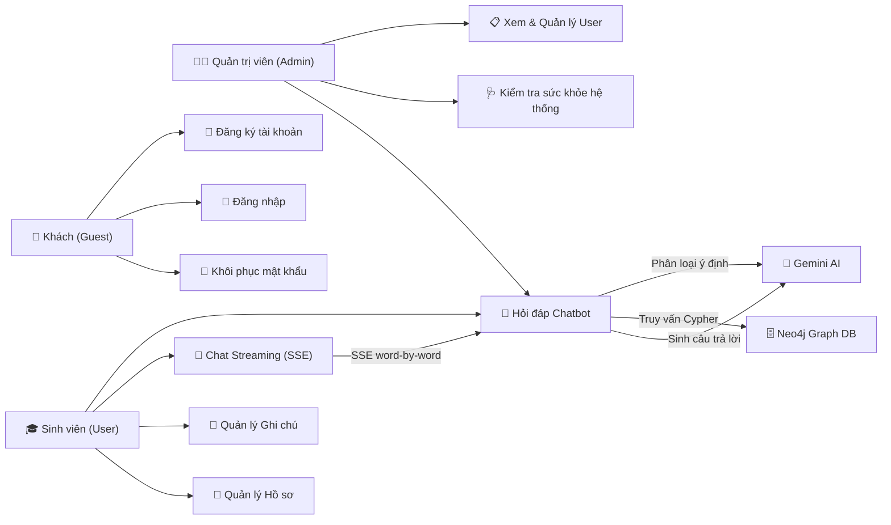
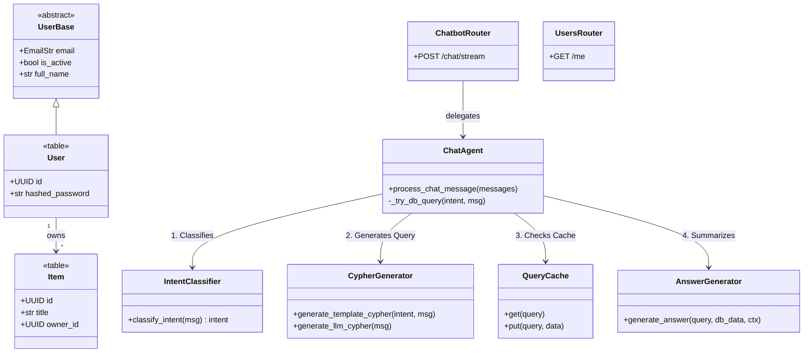
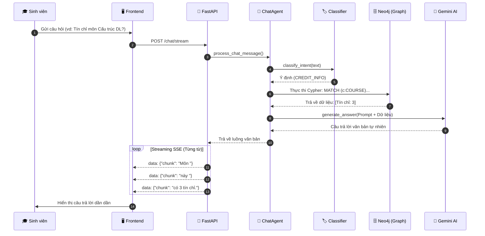
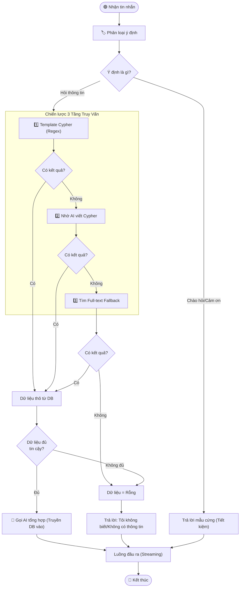

# Phân Tích Hệ Thống Chuyên Sâu (4 Mô Hình Cốt Lõi)

Tài liệu này tập trung phân tích sâu vào 4 mô hình cốt lõi nhất của hệ thống EduGuide VN (ChatBoxAI Educational): **Use Case**, **Class Diagram**, **Sequence Diagram**, và **Activity Diagram**. 

Mỗi mô hình đều đi kèm mã Mermaid. Để đưa các mô hình này vào **Draw.io**, bạn chỉ cần làm theo hướng dẫn:
1. Mở [Draw.io](https://app.diagrams.net/).
2. Chọn thanh menu **Arrange** (Sắp xếp) -> **Insert** (Chèn) -> **Advanced** (Nâng cao) -> **Mermaid...**
3. Copy mã Mermaid ở dưới và dán vào, sau đó bấm **Insert**. Draw.io sẽ tự động vẽ ra các khối và mũi tên cho bạn.

---

## 1. Phân Tích Use Case Diagram

### Phân tích hệ thống:
Use Case Diagram xác định ranh giới của hệ thống, các đối tượng tham gia (Actors) và những giá trị/chức năng mà hệ thống mang lại.
Trong hệ thống EduGuide VN, chúng ta có 3 nhóm người dùng chính và 2 hệ thống bên ngoài:
- **Khách (Guest)**: Chỉ có quyền tiếp cận các tính năng cơ bản như Đăng ký, Đăng nhập và Khôi phục mật khẩu.
- **Sinh viên (Student)**: Là người dùng trung tâm. Chức năng quan trọng nhất của họ là **Hỏi đáp Chatbot** (`UC_Chat`). Chức năng này kết hợp với **Streaming SSE** (`UC_Stream`) để nhận câu trả lời theo thời gian thực (từng từ một). Ngoài ra, sinh viên quản lý tài khoản và ghi chú cá nhân.
- **Quản trị viên (Admin)**: Kế thừa toàn bộ quyền của Sinh viên và có thêm quyền quản lý người dùng (CRUD) và kiểm tra sức khỏe hệ thống (Health Check).
- **Hệ thống tương tác ngầm (Dependencies)**: Khi Sinh viên thực hiện `UC_Chat`, hệ thống ngầm gọi đến **Gemini AI** (để hiểu câu hỏi và sinh câu trả lời) và **Neo4j DB** (để lấy dữ liệu GraphRAG).

### Mã dán vào Draw.io (Mermaid):

---

## 2. Phân Tích Class Diagram (Kiến trúc Backend & AI)

### Phân tích hệ thống:
Sơ đồ lớp (Class Diagram) thể hiện cấu trúc tĩnh của mã nguồn Backend, được chia thành 3 lớp (layers) rõ rệt:
1. **Lớp Dữ liệu (Database Models - SQLModel)**: 
   - `User` và `Item` đại diện cho các bảng trong PostgreSQL. Sử dụng tính chất kế thừa (OOP) để tách biệt `UserBase`, `UserCreate`, `UserPublic` giúp bảo mật luồng dữ liệu (không trả về `hashed_password` cho Frontend).
2. **Lớp Dịch vụ AI (AI Pipeline Layer)**: 
   - Đây là "bộ não" của hệ thống Chatbot. `ChatAgent` đóng vai trò là Orchestrator (người điều phối).
   - Khi nhận câu hỏi, `ChatAgent` gọi `IntentClassifier` để phân loại ý định (dùng Regex/Heuristics tốc độ cao).
   - Dựa vào ý định, gọi `CypherGenerator` để tạo câu lệnh truy vấn đồ thị.
   - Kết quả truy vấn được lưu vào `QueryCache` (LRU) để tránh gọi lại Database liên tục.
   - Cuối cùng, `AnswerGenerator` nhận dữ liệu thô và gọi AI tổng hợp thành câu trả lời ngôn ngữ tự nhiên.
3. **Lớp Giao tiếp (API Routers)**: 
   - `ChatbotRouter`, `UsersRouter`, `ItemsRouter` tiếp nhận HTTP Request từ Client và điều hướng vào các Dịch vụ/Models tương ứng.

### Mã dán vào Draw.io (Mermaid):

---

## 3. Phân Tích Sequence Diagram (Luồng Chat GraphRAG)

### Phân tích hệ thống:
Biểu đồ tuần tự tập trung vào khía cạnh **thời gian thực (Real-time)** của một chu kỳ hỏi-đáp. Áp dụng kiến trúc GraphRAG (Retrieval-Augmented Generation với Graph DB).
1. **Khởi tạo**: Sinh viên nhập câu hỏi trên UI.
2. **Tiếp nhận & Xác thực**: FastAPI nhận request, xác thực JWT token. Chuyển tin nhắn cho `ChatAgent`.
3. **Phân loại**: `IntentClassifier` tìm kiếm các mẫu câu để đoán ý định sinh viên (vd: hỏi về tín chỉ).
4. **Truy xuất dữ liệu (Retrieval)**: 
   - `CypherGenerator` trích xuất tên môn học (Keyword Extraction) và nhét vào Template Cypher.
   - Agent truy vấn qua `QueryCache`, nếu Miss (chưa có) thì chọc xuống Neo4j Database lấy dữ liệu dạng Node/Edge (thực thể/quan hệ).
   - Có kết quả, lưu vào Cache.
5. **Tạo nội dung (Augmented Generation)**: `AnswerGenerator` gộp [Câu hỏi + Lịch sử chat + Dữ liệu Neo4j] thành Prompt và gửi cho Gemini AI.
6. **Trả về luồng (Streaming)**: FastAPI không đợi toàn bộ câu trả lời. Nó sử dụng Server-Sent Events (SSE) để đẩy từng từ (chunk) về Frontend ngay lập tức, tạo trải nghiệm gõ chữ mượt mà.

### Mã dán vào Draw.io (Mermaid):

---

## 4. Phân Tích Activity Diagram (Luồng Xử Lý Bot)

### Phân tích hệ thống:
Biểu đồ hoạt động đi sâu vào **Logics rẽ nhánh** bên trong não bộ của `ChatAgent`. Nó thể hiện hệ thống không chỉ gọi API AI một cách mù quáng, mà có các "chiến lược dự phòng" (Fallbacks) để tối ưu độ trễ và chi phí.
1. **Kiểm tra rỗng / Tĩnh**: Lọc ngay các câu chào hỏi, cợt nhả để trả lời tĩnh mà không cần gọi Database hay LLM.
2. **Chiến lược truy vấn DB đa tầng (Multi-layered Strategy)**:
   - **Tầng 1 (Template Cypher)**: Tìm bằng Regex, dùng template cứng (Chính xác 100%, siêu nhanh).
   - **Tầng 2 (LLM Cypher)**: Nếu câu hỏi quá phức tạp, gọi Gemini bảo nó viết câu lệnh Cypher giùm. (Chậm hơn, thông minh hơn).
   - **Tầng 3 (Broad Search)**: Nếu Cypher do LLM viết bị lỗi cú pháp, lùi về tìm kiếm từ khóa full-text thông thường.
3. **Quản trị rủi ro AI (Hallucination Control)**: Nếu tất cả các tầng truy xuất DB đều không có dữ liệu, hoặc độ tin cậy quá thấp, hệ thống chủ động trả về thông báo "Không tìm thấy dữ liệu" (NO_DATA_RESPONSE) thay vì để AI bịaa ra câu trả lời sai lệch (ảo giác AI).

### Mã dán vào Draw.io (Mermaid):

