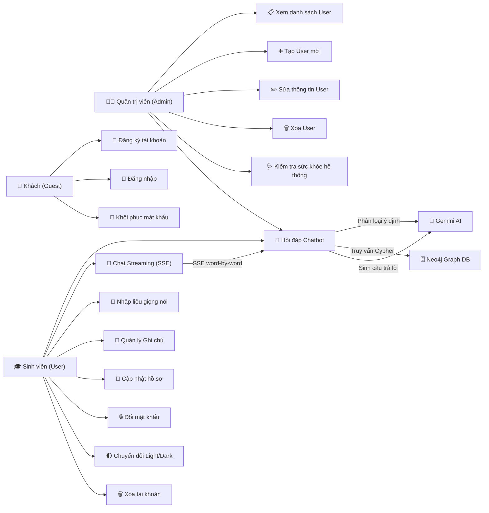
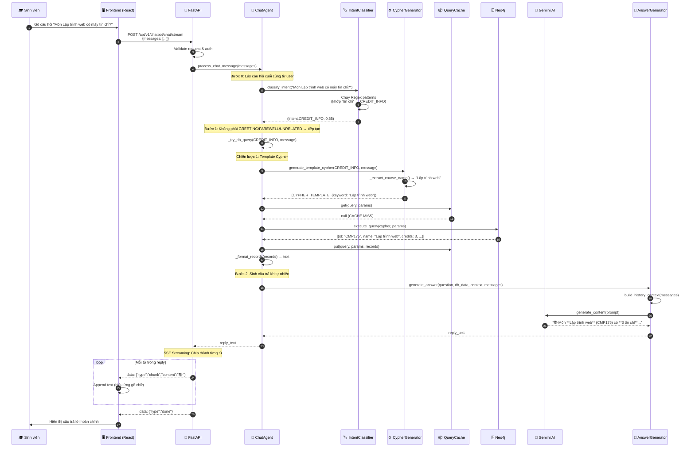
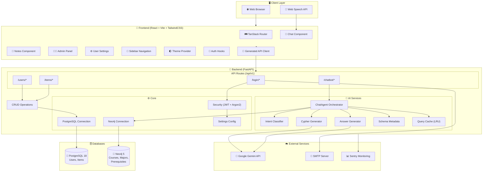
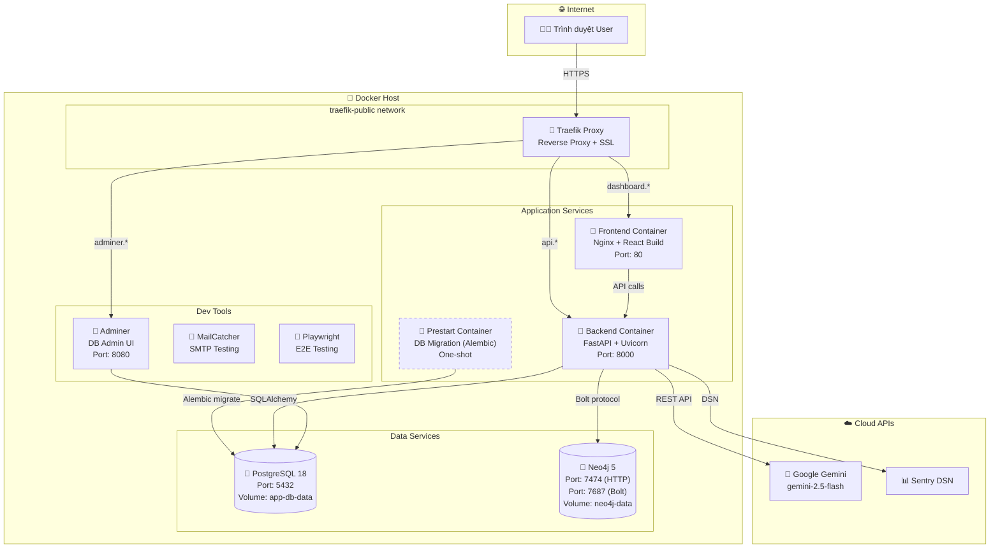
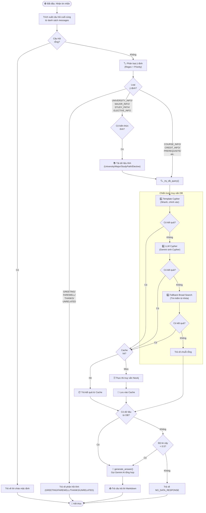
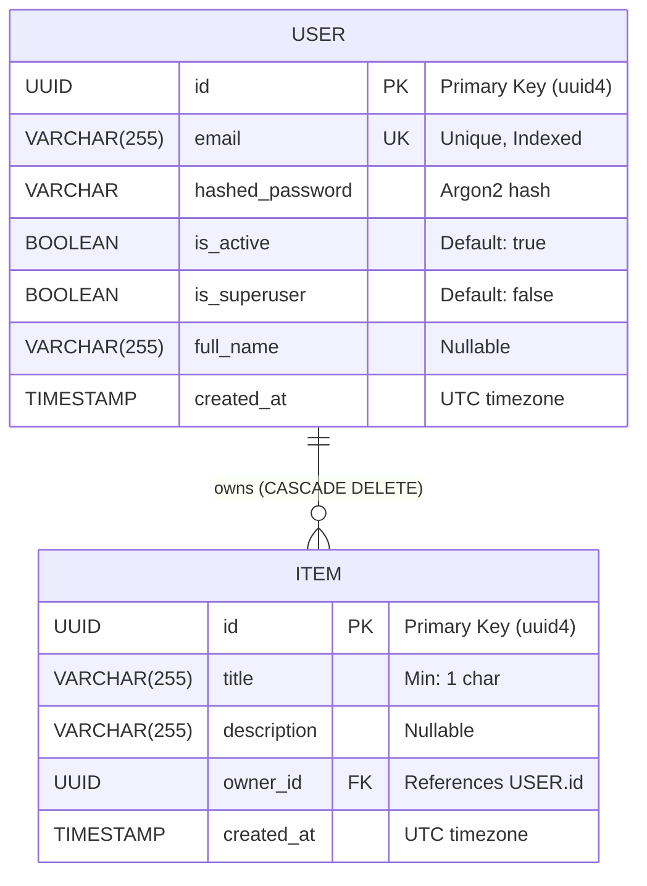
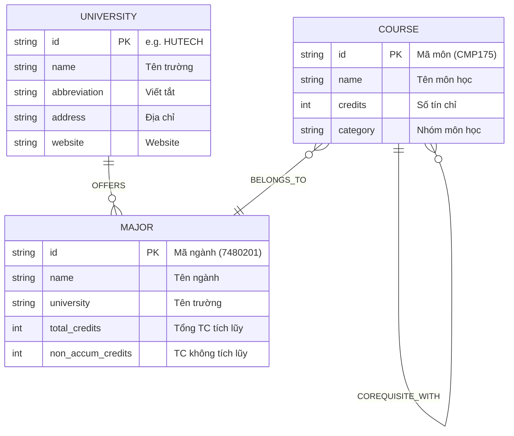

# 📐 UML Diagrams — Hệ thống EduGuide VN (ChatBoxAI Educational)

> Tài liệu này chứa các biểu đồ UML được trích xuất từ mã nguồn thực tế của dự án.
> Tất cả diagram sử dụng **Mermaid syntax** — có thể render trực tiếp trên GitHub, VS Code, hoặc bất kỳ trình Markdown nào hỗ trợ Mermaid.

---

## 📑 Mục lục

1. [Use Case Diagram](#1--use-case-diagram)
2. [Class Diagram](#2--class-diagram)
3. [Sequence Diagram — Luồng Chat GraphRAG](#3--sequence-diagram--luồng-chat-graphrag)
4. [Component Diagram](#4--component-diagram)
5. [Deployment Diagram](#5--deployment-diagram)
6. [Activity Diagram — Quy trình xử lý Chatbot](#6--activity-diagram)
7. [ER Diagram — Cơ sở dữ liệu](#7--er-diagram)

---

## 1. 🎭 Use Case Diagram

Mô tả các **tác nhân (Actor)** và **chức năng (Use Case)** của hệ thống.

> [!NOTE]
> **Sinh viên** kế thừa toàn bộ use case của **Khách** (sau khi đăng nhập).
> **Admin** kế thừa toàn bộ use case của **Sinh viên** và có thêm quyền quản trị.

---

## 2. 📦 Class Diagram

Cấu trúc các lớp chính trong Backend (FastAPI + SQLModel + Services).

```mermaid
classDiagram
    direction TB

    %% ═══════════════════════════════════════
    %%  DATABASE MODELS (SQLModel)
    %% ═══════════════════════════════════════
    class UserBase {
        <<abstract>>
        +EmailStr email
        +bool is_active
        +bool is_superuser
        +str full_name
    }

    class User {
        <<table>>
        +UUID id
        +str hashed_password
        +datetime created_at
        +List~Item~ items
    }

    class UserCreate {
        +str password
    }

    class UserRegister {
        +EmailStr email
        +str password
        +str full_name
    }

    class UserUpdate {
        +EmailStr email
        +str password
    }

    class UserUpdateMe {
        +str full_name
        +EmailStr email
    }

    class UpdatePassword {
        +str current_password
        +str new_password
    }

    class UserPublic {
        +UUID id
        +datetime created_at
    }

    class UsersPublic {
        +List~UserPublic~ data
        +int count
    }

    class ItemBase {
        <<abstract>>
        +str title
        +str description
    }

    class Item {
        <<table>>
        +UUID id
        +datetime created_at
        +UUID owner_id
        +User owner
    }

    class ItemCreate {
    }

    class ItemUpdate {
        +str title
    }

    class ItemPublic {
        +UUID id
        +UUID owner_id
        +datetime created_at
    }

    class ItemsPublic {
        +List~ItemPublic~ data
        +int count
    }

    class Token {
        +str access_token
        +str token_type
    }

    class TokenPayload {
        +str sub
    }

    class NewPassword {
        +str token
        +str new_password
    }

    class Message {
        +str message
    }

    UserBase <|-- User
    UserBase <|-- UserCreate
    UserBase <|-- UserUpdate
    UserBase <|-- UserPublic
    User "1" --> "*" Item : items

    ItemBase <|-- Item
    ItemBase <|-- ItemCreate
    ItemBase <|-- ItemUpdate
    ItemBase <|-- ItemPublic

    %% ═══════════════════════════════════════
    %%  SERVICE LAYER (AI Pipeline)
    %% ═══════════════════════════════════════
    class Intent {
        <<enumeration>>
        GREETING
        FAREWELL
        THANKS
        UNIVERSITY_INFO
        COURSE_INFO
        PREREQUISITE
        COREQUISITE
        STUDY_PATH
        CATEGORY_LIST
        MAJOR_INFO
        CREDIT_INFO
        COMPARISON
        COURSE_LIST_ALL
        ELECTIVE_INFO
        GENERAL_ADVICE
        UNRELATED
    }

    class IntentClassifier {
        +classify_intent(message) tuple
        +is_education_related(message) bool
        -_PATTERNS List
        -_UNRELATED_PATTERNS Pattern
    }

    class CypherGenerator {
        +generate_template_cypher(intent, message) tuple
        +generate_llm_cypher(user_question) str
        +generate_fallback_cypher(message) tuple
        +extract_keywords(message) str
        -_extract_course_name(message) str
        -_resolve_category_keyword(message) str
        -_extract_major_keyword(message) str
        -CYPHER_TEMPLATES dict
        -CYPHER_SYSTEM_PROMPT str
    }

    class AnswerGenerator {
        +generate_answer(question, db_data, static_context, messages) str
        -_build_history_context(messages) str
        -SYSTEM_PROMPT str
        -MAX_HISTORY_TURNS int
    }

    class ChatAgent {
        +process_chat_message(messages) str
        +get_cache_stats() dict
        -_try_db_query(intent, message) str
        -_execute_cypher(query, params) list
        -_format_records(records) str
    }

    class QueryCache {
        -OrderedDict _cache
        -int _max_size
        -int _ttl
        -int _hits
        -int _misses
        +get(query, params) list
        +put(query, params, data) void
        +stats() dict
        -_make_key(query, params) str
    }

    class SchemaMetadata {
        +UNIVERSITY_INFO dict
        +ALL_MAJORS dict
        +MAJOR_INFO dict
        +ELECTIVE_GROUPS dict
        +STUDY_PATH list
        +get_university_overview() str
        +get_major_overview() str
        +get_study_path_text() str
        +get_elective_groups_text() str
    }

    ChatAgent --> IntentClassifier : uses
    ChatAgent --> CypherGenerator : uses
    ChatAgent --> AnswerGenerator : uses
    ChatAgent --> QueryCache : uses
    ChatAgent --> SchemaMetadata : uses
    IntentClassifier --> Intent : returns
    CypherGenerator --> Intent : receives

    %% ═══════════════════════════════════════
    %%  INFRASTRUCTURE LAYER
    %% ═══════════════════════════════════════
    class Neo4jConnection {
        -Driver _driver
        +connect() void
        +close() void
        +is_connected() bool
        +health_check() dict
        +session() ContextManager
        +execute_query(query, params) list
        +get_schema_summary() str
    }

    class Settings {
        +str API_V1_STR
        +str SECRET_KEY
        +str PROJECT_NAME
        +str NEO4J_URI
        +str GEMINI_API_KEY
        +str GEMINI_CYPHER_MODEL
        +str GEMINI_ANSWER_MODEL
        +int CACHE_TTL_SECONDS
        +int CACHE_MAX_SIZE
        +all_cors_origins() list
        +SQLALCHEMY_DATABASE_URI() PostgresDsn
    }

    ChatAgent --> Neo4jConnection : queries
    CypherGenerator --> Settings : reads config
    AnswerGenerator --> Settings : reads config

    %% ═══════════════════════════════════════
    %%  API LAYER (FastAPI Routes)
    %% ═══════════════════════════════════════
    class ChatbotRouter {
        +POST /chat : chat()
        +POST /chat/stream : chat_stream()
        +GET /health : health()
    }

    class UsersRouter {
        +GET / : read_users()
        +POST / : create_user()
        +POST /signup : register_user()
        +GET /me : read_user_me()
        +PATCH /me : update_user_me()
        +PATCH /me/password : update_password_me()
        +DELETE /me : delete_user_me()
        +GET /user_id : read_user_by_id()
        +PATCH /user_id : update_user()
        +DELETE /user_id : delete_user()
    }

    class LoginRouter {
        +POST /login/access-token : login()
        +POST /login/test-token : test_token()
        +POST /password-recovery/email : recover()
        +POST /reset-password : reset()
    }

    class ItemsRouter {
        +GET / : read_items()
        +POST / : create_item()
        +GET /item_id : read_item()
        +PUT /item_id : update_item()
        +DELETE /item_id : delete_item()
    }

    ChatbotRouter --> ChatAgent : delegates
    UsersRouter --> User : manages
    ItemsRouter --> Item : manages
    LoginRouter --> Token : generates
```

---

## 3. 🔄 Sequence Diagram — Luồng Chat GraphRAG

Mô tả chi tiết luồng xử lý khi sinh viên gửi một câu hỏi qua Chatbot.

---

## 4. 🧩 Component Diagram

Kiến trúc tổng thể của hệ thống chia theo các thành phần (Component).

---

## 5. 🐳 Deployment Diagram

Mô hình triển khai thực tế với Docker Compose.

> [!TIP]
> Container **Prestart** chỉ chạy một lần khi khởi động để thực hiện database migration (Alembic), sau đó tự động dừng.

---

## 6. 🔁 Activity Diagram

Quy trình xử lý khi nhận tin nhắn từ người dùng (Pipeline xử lý chính của ChatAgent).

---

## 7. 🗃️ ER Diagram — Cơ sở dữ liệu

### 7.1 PostgreSQL (Relational — Quản lý người dùng)

### 7.2 Neo4j (Graph — Chương trình đào tạo)

> [!IMPORTANT]
> **Neo4j Relationships:**
> - `OFFERS`: Trường đào tạo ngành (University → Major)
> - `BELONGS_TO`: Môn thuộc ngành (Course → Major)
> - `PREREQUISITE_FOR`: Môn tiên quyết — phải hoàn thành trước (Course → Course)
> - `COREQUISITE_WITH`: Môn song hành — Thực hành đi kèm Lý thuyết (Course → Course)

---

## 📌 Tóm tắt kiến trúc hệ thống

| Thành phần | Công nghệ | Vai trò |
|:---|:---|:---|
| **Frontend** | React + Vite + TailwindCSS + TanStack Router | Giao diện người dùng SPA |
| **Backend** | FastAPI + SQLModel + Pydantic | REST API + AI Pipeline |
| **Auth** | JWT (OAuth2) + Argon2 Password Hashing | Xác thực & Phân quyền |
| **Relational DB** | PostgreSQL 18 | Lưu trữ User, Item |
| **Graph DB** | Neo4j 5 | Knowledge Graph — Môn học, Ngành, Quan hệ |
| **AI Engine** | Google Gemini 2.5 Flash | Phân loại ý định, Sinh Cypher, Tạo câu trả lời |
| **Caching** | LRU Cache (in-memory) | Cache kết quả Cypher (TTL 10 phút) |
| **Reverse Proxy** | Traefik | SSL termination, Routing |
| **Containerization** | Docker Compose | Orchestration toàn bộ stack |

---

*Tài liệu được tạo tự động từ phân tích mã nguồn dự án EduGuide VN — Tháng 05/2026.*
